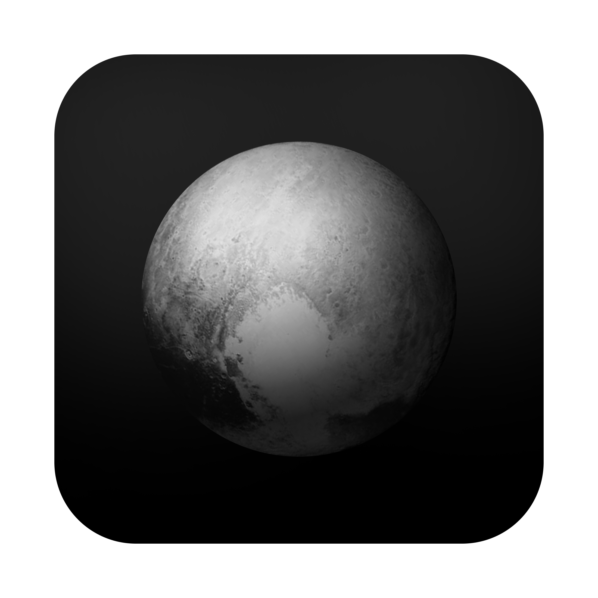

<p align="center"><a href="https://chromewebstore.google.com/detail/focus-to-your-target/medcmkcekhaggbmjpgagiajoennmlmcf" target="_blank" rel="focus focus"></a></p>
<br/>
<p align="center"><strong>Focus to Your Target</strong> analyzes web pages and aims to reduce distracting social feeds and supports keeping you <strong>focused</strong> on your target.</p>
<br/>

[![Chrome Web Store][chrome_store_light]][chrome_store_link_light] [![Chrome Web Store][chrome_store_dark]][chrome_store_link_dark] [![Microsoft Edge Add-ons][edge_store_light]][edge_store_link_light] [![Microsoft Edge Add-ons][edge_store_dark]][edge_store_link_dark]

[chrome_store_light]: images/chrome_store_light.png#gh-light-mode-only
[chrome_store_dark]: images/chrome_store_dark.png#gh-dark-mode-only
[edge_store_light]: images/microsoft_store_light.png#gh-light-mode-only
[edge_store_dark]: images/microsoft_store_dark.png#gh-dark-mode-only
[chrome_store_link_light]: https://chromewebstore.google.com/detail/medcmkcekhaggbmjpgagiajoennmlmcf#gh-light-mode-only
[chrome_store_link_dark]: https://chromewebstore.google.com/detail/medcmkcekhaggbmjpgagiajoennmlmcf#gh-dark-mode-only
[edge_store_link_light]: https://microsoftedge.microsoft.com/addons/search?term=Focus%20to%20Your%20Target#gh-light-mode-only
[edge_store_link_dark]: https://microsoftedge.microsoft.com/addons/search?term=Focus%20to%20Your%20Target#gh-dark-mode-only

<h2 align="center">Focus Your Target</h2>
<br/>
<p align="center"><strong>Focus to Your Target</strong> is an <strong>open-source</strong> MIT-licensed <strong>browser extension</strong> designed to declutter social media and improve <strong>focus</strong>. It transforms the <strong>New Tab</strong> into a minimalist dashboard that hides distracting feeds on major networks and displays inspirational quotes. <strong>Focus to Your Target</strong> is <strong>feature‑rich</strong>, includes a simple <strong>to‑do mode</strong>, and is customizable throughout the UI.</p>
<br/>

<p align="center"></p>

See live demo [here](https://chunhthanhde.github.io/focus/).

## How to contribute
Read more about contributing to Focus in CONTRIBUTING.md.

## Support 🏆

- If you wanna get updates in next version, please give me a ⭐ to the repo [👍](https://www.youtube.com/@CHUNGCINE?sub_confirmation=1)
- If you love my work and want to support, references me a part-time job, collaboration an interesting project or a good full-time job.

  Thank you so much 👍

## Developer Overview

### Local Install

1. Download `focus.zip` from [Releases](https://github.com/ChunhThanhDe/focus/releases)
2. Unzip the file
3. In Chrome/Edge go to the extensions page (`chrome://extensions` or `edge://extensions`).
4. Enable Developer Mode.
5. Drag the unzipped folder anywhere on the page to import it (do not delete the folder afterwards).
 
### Build from Source Development

#### 1. System Requirements
- Node.js: `>= 18`
- npm: `>= 9`
- Flutter: `>= 3.22` (Dart SDK `^3.7.0`)
- Chrome: latest stable with MV3 support

#### 2. Installation
```bash
# In the project root
npm install
flutter pub get
```
#### 3. Get API from Unsplash and Run Server
- Visit [Unsplash Developers](https://unsplash.com/developers)
- Sign up for an account (if you don’t have one)
- Create a new application to get your API key
- Add your API key to the `server/.env` file as `UNSPLASH_API_KEY`

Run server
```bash
# In the server folder
npm run start
```
#### 4.Build (Production)
```bash
# In the root folder
flutter pub run build_runner build --delete-conflicting-outputs

# Build Flutter web and copy into extension/newtab
npm run build:ext

# or individually
npm run build:flutter && npm run copy:newtab
```

#### 5.Load the Extension (In Developer Mode)
```text
1. Open chrome://extensions
2. Enable Developer mode
3. Click “Load unpacked” and select the `extension/` folder
4. Open a supported site; use the New Tab Settings to toggle behavior
```

## Credits

This project is inspired by [BirjuVachhani/pluto](https://github.com/BirjuVachhani/pluto)

I have reused part of the `UI idea` and `Data Mock` from this project.

